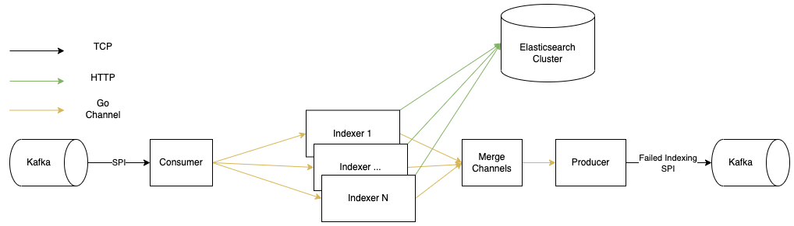

[](https://pkg.go.dev/github.com/mcgillowen/arkime-kafka-indexer)


[](https://opensource.org/licenses/Apache-2.0)
[](https://github.com/mcgillowen/arkime-kafka-indexer/actions/workflows/github-code-scanning/codeql)
[](https://codebeat.co/projects/github-com-mcgillowen-arkime-kafka-indexer-main)
[](https://goreportcard.com/report/github.com/mcgillowen/arkime-kafka-indexer)
# Arkime Kafka Indexer

An Elasticsearch indexer for Arkime SPI sent through Kafka using the Arkime [Kafka plugin](https://arkime.com/settings#kafka).

This "processor" is part of an ecosystem of "processors" that we are slowly open sourcing, this being the first one and
most important since it is necessary for Arkime to function correctly. For an introduction to this ecosystem and why to
use Kafka with Arkime see the [Arkimeet 2023 - Arkime Stream Processing with Kafka](https://youtu.be/FhNQwTyg218) talk
([slides](https://arkime.com/assets/Arkimeet2023-Arkime-Kafka.pdf)).

## Usage

This indexer is designed mainly for use with Arkime and its Kafka plugin but can also be used for indexing any Kafka
messages that are formatted in the [ES Bulk format](https://www.elastic.co/guide/en/elasticsearch/reference/current/docs-bulk.html).

The Kafka plugin needs to be configured with either `kafkaMsgFormat=bulk` or `kafkaMsgFormat=bulk1` and the `dbBulkSize`
setting should be less than `1000000` since Kafka by default doesn't allow messages larger than `1MB`, if you intend to
enrich the SPIs with a lot of extra information the `dbBulkSize` should be set accordingly or use `bulk1` but this also adds
some extra processing overhead to the Kafka cluster.

```
plugins = kafka.so
kafkaMsgFormat = bulk/bulk1
dbBulkSize = 500000
```

The indexer can handle both `bulk` and `bulk1`, since the ES Bulk API is optimized for bulks larger than `1MB`, the SPIs
get bulked together and then flushed when either a time, byte size or SPI count limit is reached, these are set using the following
environment variables respectively `BULKER_FLUSH_INTERVAL`, `BULKER_MAX_BYTES` and `BULKER_MAX_MESSAGES`. These ENV vars should be
used to tune the bulking to maximize performance, the `bulk_flush_reason_total` metrics can be used to deduce what values to change.

The indexer can also republish SPIs that failed to be indexed into ES back to Kafka for reprocessing or something else,
this is enabled by setting a producer topic using the `KAFKA_PRODUCER_TOPIC` ENV var, the other `KAFKA_PRODUCER_*` ENV vars
should be set accordingly.

### Kafka with SSL/TLS

Encrypted Kafka communication using SSL/TLS requires the following 4 ENV variables to be set:

* `KAFKA_SSL_CA_LOCATION`: Path to the CA cert used for signing certs
* `KAFKA_SSL_CERT_LOCATION`: Path to the client certificate
* `KAFKA_SSL_KEY_LOCATION`: Path to the client key
* `KAFKA_SSL_KEY_PASSWORD`: Path to the client key password

Only if all 4 variables are set will SSL/TLS communication be enabled.

The Docker compose stack is set up for using SSL/TLS, but the required certificates, keys and stores need to be generated before starting it. To generate the required files run the gen-aki-compose-certs.sh in the ssl folder.

More information about using SSL with librdkafka (underlying Kafka library used) check out https://github.com/confluentinc/librdkafka/wiki/Using-SSL-with-librdkafka

### Limitations

Currently there are a few limitations with the current implementation of the indexer, these are:

* Only HTTP support for communicating with ES, as well as unauthenticated only.

We are working to fix these limitations, but any help is welcome.

## Architecture

This processor is architected in the following way (see diagram below), the main components are:

- Consumer: consumes messages from a Kafka topic as part of a consumer group and then sends them onwards using
  a buffered Go channel
- Indexer: takes the contents of the Kafka messages that are in the Go channel and bulks them together
  , for ES performance reasons, and sends the bulked messages to ES using the [Bulk API](https://www.elastic.co/guide/en/elasticsearch/reference/current/docs-bulk.html). The response is
  then checked for errors and any SPIs that failed to index are then sent into a Go channel.
- Producer: takes the failed SPIs from the Go channel and produces them back into a Kafka topic, for further analysis and reprocessing if desired.

The number of indexers can be configured, this enables parallel sends to the elasticsearch cluster which increases the throughput.



## Installation

The easiest way to install the indexer is to use the prebuilt Docker images available
at ghcr.io/mcgillowen/arkime-kafka-indexer. These can be run using:

```
docker run -e KAFKA_CONSUMER_TOPIC=<topic> -e KAFKA_CONSUMER_GROUP_NAME=<group name> \
           -e ELASTIC_SERVICE=<ES URL without http:// or port> ghcr.io/mcgillowen/arkime-kafka-indexer:latest
```

or take a look at the Docker Compose file in this repository.

There are also binaries for `linux/amd64` and `darwin/amd64` on the [`Releases` page](https://github.com/mcgillowen/arkime-kafka-indexer/releases), we don't build other OS/arch combinations since we don't have systems to test them.

It can also be installed the normal Go way:
```
go install github.com/mcgillowen/arkime-kafka-indexer@v0.1.2
```

## Configuration

Configuration of the indexer is done using environment variables following the 12-factor app approach, documented at [12factor.net](https://12factor.net).

| NAME                                  | VARIABLE                                  | TYPE          | DEFAULT                                                                     | DESCRIPTION                                                                      |
|---------------------------------------|-------------------------------------------|---------------|-----------------------------------------------------------------------------|----------------------------------------------------------------------------------|
| Port                                  | PORT                                      | string        | 8080                                                                        | Port for the HTTP server                                                         |
| LogLevel                              | LOG_LEVEL                                 | string        | debug                                                                       | The level to log at                                                              |
| KafkaConsumerBrokers                  | KAFKA_CONSUMER_BROKERS                    | string        | localhost:9092                                                              | Kafka Broker to consume from                                                     |
| KafkaConsumerTopic                    | KAFKA_CONSUMER_TOPIC                      | string        |                                                                             | Kafka topic to consume from                                                      |
| KafkaConsumerGroupName                | KAFKA_CONSUMER_GROUP_NAME                 | string        |                                                                             | Name of the Kafka consumer group                                                 |
| KafkaConsumerIncrementalRebalance     | KAFKA_CONSUMER_INCREMENTAL_REBALANCE      | bool          | false                                                                       | If the cooperative rebalancing strategy should be used                           |
| KafkaProducerBrokers                  | KAFKA_PRODUCER_BROKERS                    | string        | localhost:9092                                                              | Kafka to produce to                                                              |
| KafkaProducerTopic                    | KAFKA_PRODUCER_TOPIC                      | string        |                                                                             | Kafka topic to produce to                                                        |
| KafkaSSLCALocation                    | KAFKA_SSL_CA_LOCATION                     | string        |                                                                             | Path to the CA cert used for signing certs                                       |
| KafkaSSLCertLocation                  | KAFKA_SSL_CERT_LOCATION                   | string        |                                                                             | Path to the client certificate                                                   |
| KafkaSSLKeyLocation                   | KAFKA_SSL_KEY_LOCATION                    | string        |                                                                             | Path to the client key                                                           |
| KafkaSSLKeyPassword                   | KAFKA_SSL_KEY_PASSWORD                    | string        |                                                                             | Password of the client key                                                       |
| KafkaProducerMessageTimeout           | KAFKA_PRODUCER_MSG_TIMEOUT                | time.Duration | 30s                                                                         | Produced message timeout                                                         |
| KafkaProducerMessageRetries           | KAFKA_PRODUCER_MSG_RETRIES                | int           | 100                                                                         | Maximum of retries for a produced message                                        |
| KafkaProducerQueueFullCooldown        | KAFKA_PRODUCER_FULL_QUEUE_COOLDOWN        | time.Duration | 1s                                                                          | How long to wait after a producer full queue error before retrying               |
| KafkaProducerLogDeliveryReports       | KAFKA_PRODUCER_LOG_DELIVERY_REPORTS       | bool          | true                                                                        | Should the delivery reports be logged                                            |
| KafkaSessionTimeout                   | KAFKA_SESSION_TIMEOUT                     | time.Duration | 6000ms                                                                      | Kafka session timeout length                                                     |
| KafkaPollTimeout                      | KAFKA_POLL_TIMEOUT                        | time.Duration | 100ms                                                                       | Consumer polling timeout                                                         |
| KafkaFlushInterval                    | KAFKA_FLUSH_INTERVAL                      | time.Duration | 100ms                                                                       | Timeout length when flushing Kafka messages at shutdown                          |
| BulkerFlushInterval                   | BULKER_FLUSH_INTERVAL                     | time.Duration | 10s                                                                         | Maximum amount of time to buffer messages before sending them to ES              |
| BulkerMaxMessages                     | BULKER_MAX_MESSAGES                       | int           | 100                                                                         | Maximum number of messages to buffer before sending them to ES                   |
| BulkerMaxBytes                        | BULKER_MAX_BYTES                          | int           | 10_485_760                                                                  | Maximum number of bytes to buffer before sending them to ES                      |
| ElasticService                        | ELASTIC_SERVICE                           | string        |                                                                             | The address of an Elasticsearch node, the client will discover the rest of nodes |
| ElasticServicePort                    | ELASTIC_SERVICE_PORT                      | string        | 9200                                                                        | The ES HTTP port                                                                 |
| ElasticIndexerInstances               | ELASTIC_INDEXER_INSTANCES                 | int           | 1                                                                           | The number of parallel indexers to use                                           |
| ElasticClientMaxRetries               | ELASTIC_CLIENT_MAX_RETRIES                | int           | 10                                                                          | Number of retries when communicating with ES                                     |
| ElasticClientRetryStatuses            | ELASTIC_CLIENT_RETRY_STATUSES             | []int         | 502,503,504,429                                                             | Which HTTP status codes to retry                                                 |
| ElasticClientDiscoverNodes            | ELASTIC_CLIENT_DISCOVER_NODES             | bool          | true                                                                        | Should the client discover the other ES nodes                                    |
| ElasticClientDiscoverInterval         | ELASTIC_CLIENT_DISCOVER_INTERVAL          | time.Duration | 1h                                                                          | Interval between updates of the list of ES connections                           |
| ElasticClientBulkTimeout              | ELASTIC_CLIENT_BULK_TIMEOUT               | time.Duration | 500ms                                                                       | The timeout duration for the Bulk call                                           |
| ElasticClientMaxDeadPercentage        | ELASTIC_CLIENT_MAX_DEAD_PERCENTAGE        | int           | 20                                                                          | The maximum percentage of dead ES connections                                    |
| ElasticTransportDialTimeout           | ELASTIC_TRANSPORT_DIAL_TIMEOUT            | time.Duration | 2s                                                                          |                                                                                  |
| ElasticTransportDialKeepAlive         | ELASTIC_TRANSPORT_DIAL_KEEPALIVE          | time.Duration | 5s                                                                          |                                                                                  |
| ElasticTransportMaxIdleConns          | ELASTIC_TRANSPORT_MAX_IDLE_CONNS          | int           | 100                                                                         |                                                                                  |
| ElasticTransportMaxIdleConnsPerHost   | ELASTIC_TRANSPORT_MAX_IDLE_CONNS_PER_HOST | int           | 100                                                                         |                                                                                  |
| ElasticTransportMaxConnsPerHost       | ELASTIC_TRANSPORT_MAX_CONNS_PER_HOST      | int           | 100                                                                         |                                                                                  |
| ElasticTransportIdleConnTimeout       | ELASTIC_TRANSPORT_IDLE_CONN_TIMEOUT       | time.Duration | 10s                                                                         |                                                                                  |
| ElasticTransportExpectContinueTimeout | ELASTIC_TRANSPORT_EXPECT_CONTINUE_TIMEOUT | time.Duration | 1s                                                                          |                                                                                  |
| ConsumerChannelBufferSize             | CONSUMER_CHANNEL_BUFFER_SIZE              | int           | 10                                                                          |                                                                                  |
| ErrorChannelBufferSize                | ERROR_CHANNEL_BUFFER_SIZE                 | int           | 10                                                                          |                                                                                  |
| ProducerChannelBufferSize             | PRODUCER_CHANNEL_BUFFER_SIZE              | int           | 10                                                                          |                                                                                  |
| MetricsNamespace                      | METRICS_NAMESPACE                         | string        | arkime                                                                      |                                                                                  |
| MetricsSubsystem                      | METRICS_SUBSYSTEM                         | string        | kafkaindexer                                                                |                                                                                  |
| MetricsPath                           | METRICS_PATH                              | string        | /metrics                                                                    |                                                                                  |
| FlushedBytesBuckets                   | METRICS_FLUSHED_BYTES_BUCKETS             | []float64     | 50_000,100_000,500_000,1_000_000,5_000_000,25_000_000,50_000_000,75_000_000 |                                                                                  |
| FlushedMsgsBuckets                    | METRICS_FLUSHED_MSGS_BUCKETS              | []float64     | 2,4,8,16,32,64,128,256                                                      |                                                                                  |


## Tasks

The following subsections define tasks that can be run using the [xc tool](https://xcfile.dev/), this tool executes the commands within the code block of each subsection, with
the name of the subsection being the name of the command, eg. `xc lint` for running the
commands contained within the code block of the "Lint" subsection.

### Deps

Installs the dependencies for building, formatting, linting, etc.

```
# Installs gofumpt for formatting the source code with extra rules
go install mvdan.cc/gofumpt@latest
# Installs golangci-lint for linting, uses the .golangci.yaml
curl -sSfL https://raw.githubusercontent.com/golangci/golangci-lint/master/install.sh | sh -s -- -b $(go env GOPATH)/bin v1.55.2
# Installs the Go vulnerability checking tool
go install golang.org/x/vuln/cmd/govulncheck@latest
```

### Precommit

Sets up [pre-commit](https://pre-commit.com/) to run when committing.

Requires `pre-commit` to be installed before hand, see [pre-commit/Installation](https://pre-commit.com/#installation)

```
pre-commit run --all-files
pre-commit install
```

### Format

Formats the code to ensure a consistent formatting

```
gofumpt -l -w .
```

### Lint

Lints the source code according to the configuration in the `.golangci.yaml` file

```
govulncheck ./...
golangci-lint run ./...
```

### Test

Runs the unit-tests

```
go test -race github.com/mcgillowen/arkime-kafka-indexer/...
```

### Snapshot-Dry-Run

Creates a snapshot release using GoReleaser and GoReleaser-Cross but without publishing it.

```
docker run \
  --rm \
  -e CGO_ENABLED=1 \
  -v /var/run/docker.sock:/var/run/docker.sock \
  -v `pwd`:/go/src/github.com/mcgillowen/arkime-kafka-indexer \
  -w /go/src/github.com/mcgillowen/arkime-kafka-indexer \
  ghcr.io/goreleaser/goreleaser-cross:v1.21.6 \
  --clean --skip=publish --snapshot
```

### Snapshot

Creates a snapshot release using GoReleaser and GoReleaser-Cross.

```
docker run \
  --rm \
  -e CGO_ENABLED=1 \
  -v $(HOME)/.docker/config.json:/root/.docker/config.json \
  -v /var/run/docker.sock:/var/run/docker.sock \
  -v `pwd`:/go/src/github.com/mcgillowen/arkime-kafka-indexer \
  -w /go/src/github.com/mcgillowen/arkime-kafka-indexer \
  ghcr.io/goreleaser/goreleaser-cross:v1.21.6 \
  --clean --snapshot
```

### Release-Dry-Run

Creates a normal release using GoReleaser and GoReleaser-Cross but without publishing it.

```
docker run \
  --rm \
  -e CGO_ENABLED=1 \
  -v /var/run/docker.sock:/var/run/docker.sock \
  -v `pwd`:/go/src/github.com/mcgillowen/arkime-kafka-indexer \
  -w /go/src/github.com/mcgillowen/arkime-kafka-indexer \
  ghcr.io/goreleaser/goreleaser-cross:v1.21.6 \
  --clean --skip=publish
```

### Release

Creates a release using GoReleaser and GoReleaser-Cross.

Inputs: GITHUB_TOKEN
```
docker run \
  --rm \
  -e CGO_ENABLED=1 \
  -e GITHUB_TOKEN=$GITHUB_TOKEN \
  -v $HOME/.docker/config.json:/root/.docker/config.json \
  -v /var/run/docker.sock:/var/run/docker.sock \
  -v `pwd`:/go/src/github.com/mcgillowen/arkime-kafka-indexer \
  -w /go/src/github.com/mcgillowen/arkime-kafka-indexer \
  ghcr.io/goreleaser/goreleaser-cross:v1.21.6 \
  release --clean
```
